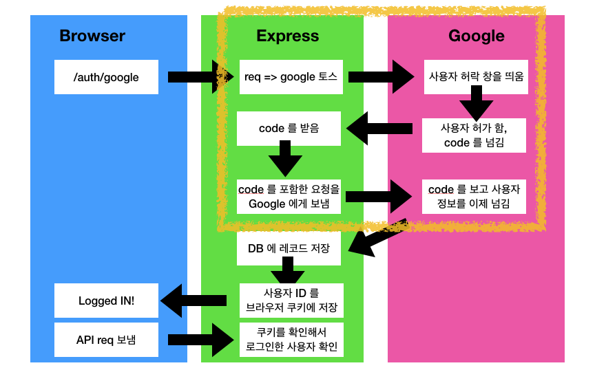

## Google OAuth

## Intro Google OAuth & Flow

Sign in with Google, Facebook, Github, etc..

직접 가입보다 OAuth 가 더 사용자 가입을 이끌어 내기 쉽다.



| Client                            |                                        | Server                                          |                                                           | Google                                                       |
| --------------------------------- | -------------------------------------- | ----------------------------------------------- | --------------------------------------------------------- | ------------------------------------------------------------ |
| User click 'LOGIN'                | =`url:5000/auth/google` 로 direct=>    | **User 요청을 Google 로 포워드**                | **=`google.com/auth?appid=123`=>**                        | **사용자에게 허락을 받음**                                   |
|                                   |                                        | **사용자는 기다리며 `code` 를 받음**            | **<=`url:5000/auth/google/callback?code=456`= 로 direct** | **사용자가 허용함**                                          |
|                                   |                                        | **`code` 를 포함한 요청을 Google 에게 보냄**    | **=>**                                                    | **Google 이 URL 에 실린 `code` 를 보고 사용자 정보를 담은 응답을 보냄** |
|                                   |                                        | 사용자 정보를 받아 새로운 레코드를 DB 에 추가함 |                                                           |                                                              |
| Logged in!                        | <=사용자를 `url:5000` 으로 리다이렉트= | 사용자ID 를 쿠키에 저장함                       |                                                           |                                                              |
| API 에서 필요한 resource 가 있어! | =요청에 쿠키가 포함되어 있음=>         | 오 쿠키에 사용자 ID 가 있어. 줘도 되겠군        |                                                           |                                                              |

**bold** 부분이 PassportJS 가 해주는 일이다.

## Passport JS 

http://passportjs.org

https://github.com/jaredhanson/passport-google-oauth2

passportJS 가 모든 일을 해 주는것은 아니다. 특정 부분에서는 우리가 코드를 작성해서 처리해 줘야 한다. 그리고 PassportJS 하다 보면, 굉장히 맘에 안드는 부분은 큰 그림은 모르는 채, 이상한 코드만 적는 느낌이 들기 때문이다. 그리고 PassportJS 의 내부 구조를 모르기 때문에 더욱 그렇다.

PassportJS 를 설치할 때 우리는 두가지 라이브러리를 설치하는 것이다.

* Passport : 가장 일반적인 helper 들과 auth 를 Express 에서 처리할 수 있는 라이브러리
* Passport Strategy : 특정한 auth 제공자와(Facebook, Google, Local, etc..) 매치되는 라이브러리. 즉 무조건 한가지는 설치하게 되어 있다.

```sh
$ pwd
/.../.../MERN/server
$ npm i passport passport-google-oauth20 # 2.0
```

`server/index.js`

```js
const express = require('express'); // nodeJS 는 commonjs require 만 사용가능.
const passport = require('passport');
const GoogleStrategy = require('passport-google-oauth20').Strategy;

const app = express();

passport.use(new GoogleStrategy());

const PORT = process.env.PORT || 5000; 
app.listen(PORT, () => {console.log(`Listening on port ${PORT}`)});
```

### Google OAuth API

https://console.developers.google.com

New project => Enable API => google+ API => 사용설정 => 사용자 인증 정보 생성 

Google+ API / 웹 서버 / 사용자 데이터 => express-passport-dev / MERN APP

승인된 자바스크립트 원본: http://localhost:5000 / 승인된 리디렉션 URI: http://localhost:5000

**다운로드(repo바깥에! 아니면 `.gitignore` 에 추가하기!)**

### API keys?

clientID: Public token : 남들과 공유 가능

clientSecret: 절대로 분실하면 안됨

```sh
$ pwd
/.../.../MERN/server
$ mkdir config
$ touch config/keys.js
$ echo 'keys.js' >> .gitignore
```

`server/config/keys.js`

```js
module.exports = {
  googleClientID: '<YOUR_CLIENT_KEY>', // ID 대문자로!
  googleClientSecret: '<YOUR_CLIENT_SECRET>'
}
```

`server/index.js`

```js
const express = require("express"); // nodeJS 는 commonjs require 만 사용가능.
const passport = require("passport");
const GoogleStrategy = require("passport-google-oauth20").Strategy;
const keys = require("./config/keys");

const app = express();

passport.use(
  new GoogleStrategy(
    {
      clientID: keys.googleClientID,
      clientSecret: keys.googleClientSecret,
      callbackURL: "/auth/google/callback"
    },
    accessToken => {
      console.log(accessToken);
    }
  )
);

app.get(
  "/auth/google",
  passport.authenticate("google", {
    scope: ["profile", "email"]
  })
);

const PORT = process.env.PORT || 5000;
app.listen(PORT, () => {
  console.log(`Listening on port ${PORT}`);
});

```

라우트 핸들러에 `passport.authenticat()` 에서 첫번째 인자인 `'google'` 를 passport 가 자동으로 인식하고 google strategy 를 사용하도록 한다. `scope` 는 우리가 접근하고자 하는 scope 다. docs 를 읽으면 어떤 스코프를 사용할 수 있는지 나와 있다.

`http://localhost:5000/auth/google` 로 접속하면 redirect_uri_mismatch 라고 나타난다. Request Detail 도 살펴보자. 

```
https://accounts.google.com/o/oauth2/v2/auth?response_type=code
&redirect_uri=http%3A%2F%2Flocalhost%3A5000%2Fauth%2Fgoogle%2Fcallback&scope=profile%20email
&client_id=1040806080298-ouq493as4khtsr79tmfe3iqng9q22sq7.apps.googleusercontent.com
```

url 에서 해커가 redirect_uri 를 우리 서버로 하이재킹 할 수 도 있다. 이걸 방지하려면, Google app 설정도 바꿔줘야 한다.

승인된 리디렉션 URI: http://localhost:5000/auth/google/callback 로 바꾸자 시간이 좀 걸린다.

## OAuth callback

이제 grant 할 것인지를 물어보는 창이 나온다! 이제 사용자가 grant 를 하면 `code` 를 받게 된다. `auth/google/callback` 라우터를 정의하자.

`server/index.js`

```js
const express = require("express"); // nodeJS 는 commonjs require 만 사용가능.
const passport = require("passport");
const GoogleStrategy = require("passport-google-oauth20").Strategy;
const keys = require("./config/keys");

const app = express();

passport.use(
  new GoogleStrategy(
    {
      clientID: keys.googleClientID,
      clientSecret: keys.googleClientSecret,
      callbackURL: "/auth/google/callback"
    },
    accessToken => {
      console.log(accessToken);
    }
  )
);

app.get(
  "/auth/google",
  passport.authenticate(
    "google",
    { scope: ["profile", "email"] },

    )
);

app.get( // 미완성
  '/auth/google/callback',
  passport.authenticate('google')
);

const PORT = process.env.PORT || 5000;
app.listen(PORT, () => {
  console.log(`Listening on port ${PORT}`);
});

```

이제 grant 하면, `console.log(accessToken)` 이 출력된다. 이제 우리는 이 token 을 사용자 정보로 바꿔서 저장해야 한다.

`server/index.js`

```js
...
passport.use(
  new GoogleStrategy(
    {
      clientID: keys.googleClientID,
      clientSecret: keys.googleClientSecret,
      callbackURL: "/auth/google/callback"
    },
    (accessToken, refreshToken, profile, done) => {
      console.log('access token', accessToken);
      console.log('refresh token', refreshToken);
      console.log('profile', profile);
      console.log('done', done);
    }
  )
);
...
```

`refreshToken` 은 `accessToken` 은 자동으로 만료되어 갱신하는것과 관련된 내용이다. 우리가 신경쓰지 않을 부분! `done` 은 함수네!

## Nodemon setting

`server/package.json`

```json
...

  "scripts": {
    "start": "node index.js",
    "dev": "nodemon index.js"
  },
...
```


