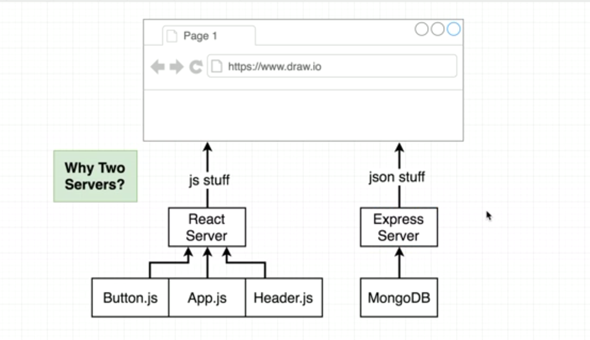
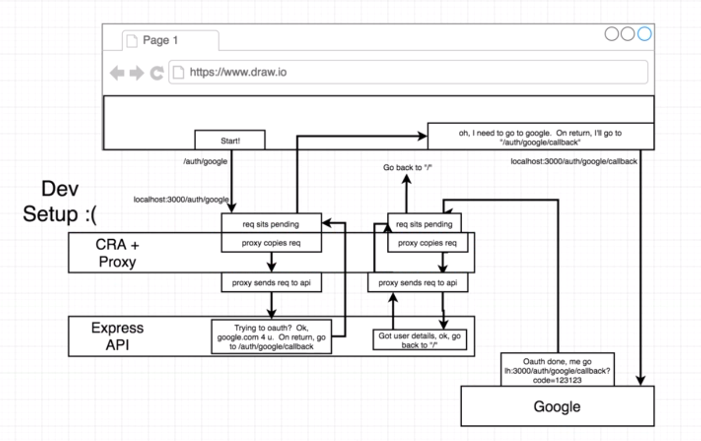
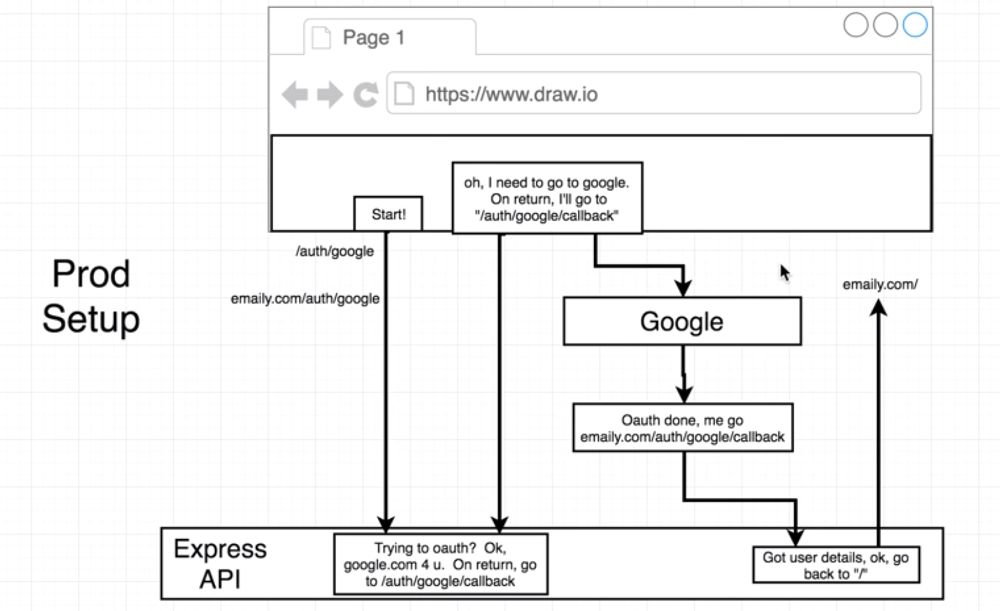

# Client Side 1

React App => `create-react-app` 을 설치만 하지말고 문서를 읽자. 정말 좋은 문서임ㅇㅇ

`server` dir 안에서**(중요)** 명령어를 실행하자

```sh
$ pwd
/.../.../MERN/server
$ npx create-react-app client
$ cd client
$ pwd
/.../.../MERN/server/client
$ npm start
```

## 분리된 Back - Front 

가장 중요한 것은 client-server 의 분리다.`server/client/` 로 이루어져 있는 지금의 아키텍쳐! 

그런데 왜 react 서버가 따로 필요할까?



## Client & Server 동시 실행

```sh
$ pwd
/.../.../MERN/server # not client
$ npm i concurrently
```

`server/package.json`

```json
"scripts": {
    "start": "node index.js",
    "server": "nodemon index.js",
    "client": "npm run start --prefix client",
    "dev": "concurrently \"npm run server\" \"npm run client\""
  },
```


## Routing

`client/src/App.js`

```jsx
import React, { Component } from 'react';
import './App.css';

class App extends Component {
  render() {
    return (
      <div className="App">
        <a href="/auth/google">Sign in with Google</a>
      </div>
    );
  }
}

export default App;
```

`href=???` `localhost:3000`/`localhost:5000` 뭘 써야하지? 링크가 맘에 안든다. 배포때는 어떻게 할 것이며 경우마다 바꾸고 싶지 않다.

## Proxy - Create react app 2.0

```sh
$ pwd
/.../.../MERN/server/client
$ npm i http-proxy-middleware
$ touch src/setupProxy.js
```

`client/src/setupProxy.js`

```js
const proxy = require('http-proxy-middleware');

module.exports = (app) => {
  app.use(proxy('/auth/google', { target: 'http://localhost:5000' }));
  app.use(proxy('/api', { target: 'http://localhost:5000' }));
};
```

승인된 리디랙션 URI

`http://localhost:5000/auth/google/callback`

`http://localhost:3000/auth/google/callback`

## CRA-proxy

proxy? `client` 안에서 `/auth/google` 로 접속하면, `localhost:5000/auth/google` 로 보낸다.

근데 배포모드에서는? 배포하게되면, 리액트는 서버가 없다. `$ npm run build` 를 완료하면, 그냥 단순한 js 파일이 된다.(`public/`) 그리고 이 단순한 html/css/js 를 express 가 제공하는 것이다. 리액트는 express 에 추가되는 것 뿐이다. 프록시도 의미가 없어진다. 지금 한 세팅은 dev 에서만 사용한다.

## Why this architecture

React <=> Express 를 두개의 서버로 구성 할 수 도 있다. 이 경우에는 JWT 를 사용해야 한다.

하지만 지금 우리가 사용하는 express 의 auth 는 쿠키 기반이다. 때문에, 도메인을 통일하는게 중요하다.

dev에서는 proxy 가 localhost:3000 으로 들어온 요청을 복사해서 localhost:5000 으로 보낸다. 

또한 localhost:3000 에서 5000 으로 보내게 되면, CORS(Cross Origin Resource Sharing) 라는 보안 이슈갸 생긴다. 물론 이것도 전부 해결할 수 있지만, 추가적인 작업이 계속해서 발생한다.

즉 추가적인 작업을 줄이고 MERN app 자체에 집중하고자 이런 아키텍쳐를 선택했다.

### dev proxy



### Prod No proxy

