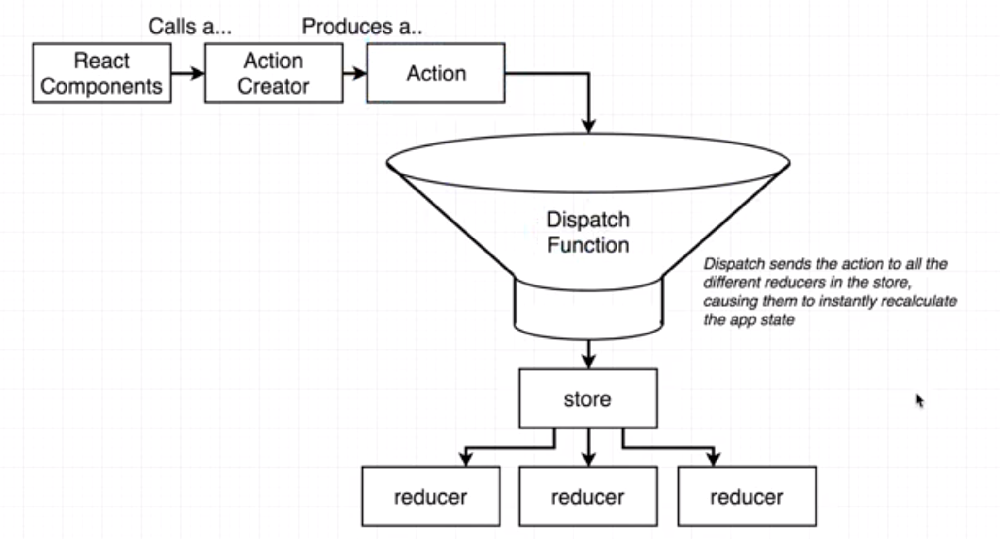

# Client Side 2

## Refactor async-await

`server/services/passport.js`

```js
const passport = require("passport");
const GoogleStrategy = require("passport-google-oauth20").Strategy;
// const mongoose = require("mongoose");
const { User } = require("../models/User");
const config = require("config");

passport.serializeUser((user, done) => {
  done(null, user.id);
});

passport.deserializeUser((id, done) => {
  User.findById(id).then(user => {
    done(null, user);
  });
});

passport.use(
  new GoogleStrategy(
    {
      clientID: config.auth.google.clientID,
      clientSecret: config.auth.google.clientSecret,
      callbackURL: "/auth/google/callback",
      proxy: true
    },
    async (accessToken, refreshToken, profile, done) => {
      const existingUser = await User.findOne({ googleID: profile.id });
      if (existingUser) { // User exists
        done(null, existingUser);
      } else { // no such user
        let newUser = await new User({ googleID: profile.id }).save();
        done(null, newUser);
      }
    }
  )
);

```

## Front End TECH

* React 
* React router
* Redux

## React Setup

```sh
$ pwd
/.../.../MERN/server/client
$ # delete all file in src except setupProxy.js
$ mkdir src/components
$ touch src/index.js
$ touch src/components/App.js
$ npm i redux react-redux react-router-dom
```

## Installing Root Modules

`client/src/components/App.js`

```jsx
import React, {Component} from 'react';

class App extends Component {
  render() {
    return (
      <div>
        HappyHacking
      </div>
    );
  }
}

export default App;
```

`client/src/index.js`

```jsx
import React from 'react';
import ReactDOM from 'react-dom';
import App from './components/App';

ReactDOM.render(<App />, document.querySelector('#root'));
```

## Redux Review and setup

* Redux store
  * combineReducer
    * authReducer
    * postsReducer

`src/index.js`

```jsx
import React from 'react';
import ReactDOM from 'react-dom';

import { Provider } from 'react-redux';
import { createStore, applyMiddleware } from 'redux';

import App from './components/App';
import reducers from './reducers';

const store = createStore();

ReactDOM.render(
  <Provider store={store}>
    <App />
  </Provider>,
  document.querySelector('#root'));
```


## The Auth Reducer

```sh
$ pwd
/.../server/client
$ mkdir src/reducers
$ touch src/reducers/authReducer.js
$ touch src/reducers/index.js
```

`src/reducers/authReducer.js`

```js
const auth = (state={}, action) => {
  console.log(action);
  switch (action.type) {
    default:
      return state;
  }
};

export default auth;
```

## Finshs reducer setup

`src/reducers/index.js`

```js
import { combineReducers } from "redux";
import authReducer from './authReducer';

export default combineReducers({
  auth: authReducer,
});

```

`src/index.js`

```jsx
import React from 'react';
import ReactDOM from 'react-dom';

import { Provider } from 'react-redux';
import { createStore, applyMiddleware } from 'redux';

import App from './components/App';
import reducers from './reducers';

const store = createStore(reducers, {}, applyMiddleware()); // combined reducers, default state(optional), 

ReactDOM.render(
  <Provider store={store}>
    <App />
  </Provider>,
  document.querySelector('#root'));
```

보일러플레이트

## Why auth and react

`<Header>` 에서 auth 관련 state 를 참조하여 Login / Logout 을 포함해 여러 가지 경우의 수를 분기해야한다. 기능들도 auth 여부에 따라 분리해야 한다.

## React router GOGO

`src/components/App.js`

```jsx
import React, {Component} from 'react';
import { BrowserRouter, Route } from "react-router-dom";

const Header = () => <h2>Header</h2>;
const Dashboard = () => <h2>Dashboard</h2>;
const PostNew = () => <h2>New Post</h2>;
const Landing = () => <h2>Landing</h2>;

class App extends Component {
  render() {
    return (
      <div>
        <BrowserRouter>
          {/* 여기도 한 덩어리만! */}
          <div>
            <Route path="/" component={Landing} />
          </div>
        </BrowserRouter>
      </div>
    );
  }
}

export default App;
```

browser router 는 모든 라우팅을 관리한다. route 는 실제 뭘 보여줄지 결정한다.

즉 사용자가 접속한 라우팅에 따라 보여주는 컴포넌트가 달라지게 되는 것이다. 서버와는 관계없다. 서버는 해당 URL 에서 어떤 데이터를 보여줄지를 결정한다.

```jsx
import React, {Component} from 'react';
import { BrowserRouter, Route } from "react-router-dom";

const Header = () => <h2>Header</h2>;
const Dashboard = () => <h2>Dashboard</h2>;
const SurveyNew = () => <h2>SurveyNew</h2>;
const Landing = () => <h2>Landing</h2>;

class App extends Component {
  render() {
    return (
      <div>
        <BrowserRouter>
          {/* 여기도 한 덩어리만! */}
          <div>
            <Route path="/" component={Landing} />
            <Route path="/surveys" component={Dashboard} />
            
          </div>
        </BrowserRouter>
      </div>
    );
  }
}

export default App;
```

`/surveys` 로 가면 랜딩페이지도 같이 나온다. 이건 리액트 라우터가 `path` 안에 있는 내용과 글자를 비교해서 해당 문자열이 있으면 보여주기 때문이다.

```jsx
import React, {Component} from 'react';
import { BrowserRouter, Route } from "react-router-dom";

const Header = () => <h2>Header</h2>;
const Dashboard = () => <h2>Dashboard</h2>;
const SurveyNew = () => <h2>SurveyNew</h2>;
const Landing = () => <h2>Landing</h2>;

class App extends Component {
  render() {
    return (
      <div>
        <BrowserRouter>
          {/* 여기도 한 덩어리만! */}
          <div>
            <Route exact={true} path="/" component={Landing} />
            <Route path="/surveys" component={Dashboard} />
            
          </div>
        </BrowserRouter>
      </div>
    );
  }
}

export default App;
```

이제 우리가 기대하는 대로 나온다. 줄여서 `exact path="/"` 로 사용 가능하다.

### 언제나 보이는 컴포넌트

```jsx
import React, {Component} from 'react';
import { BrowserRouter, Route } from "react-router-dom";

const Header = () => <h2>Header</h2>;
const Dashboard = () => <h2>Dashboard</h2>;
const SurveyNew = () => <h2>SurveyNew</h2>;
const Landing = () => <h2>Landing</h2>;

class App extends Component {
  render() {
    return (
      <div>
        <BrowserRouter>
          <div>
            <Header />
            <Route exact path="/" component={Landing} />
            <Route exact path="/surveys" component={Dashboard} />
            <Route exact path="/surveys/new" component={SurveyNew} />
          </div>
        </BrowserRouter>
      </div>
    );
  }
}

export default App;
```

Router 를 사용하지 않으면 어떤 라우트에서든지 보이게 된다. 대신 `<Header />` 의 내용물은 state 엗따라 바뀌게 되므로, route 와 관계가 없다.

## Let's get it

```sh
$ pwd
/.../server/client
$ touch src/components/Header.js
$ touch src/components/Landing.js
$ touch src/components/Dashboard.js
$ touch src/components/SurveyNew.js
```

`client/src/components/Header.js`

```jsx
import React from 'react';

const Header = () => {
  return (
    <div>
      Header
    </div>
  );
};

export default Header;
```

`client/src/components/App.js`

```jsx
import React, {Component} from 'react';
import { BrowserRouter, Route } from "react-router-dom";
import Header from "./Header";

const Dashboard = () => <h2>Dashboard</h2>;
const SurveyNew = () => <h2>SurveyNew</h2>;
const Landing = () => <h2>Landing</h2>;

class App extends Component {
  render() {
    return (
      <div>
        <BrowserRouter>
          <div>
            <Header />
            <Route exact path="/" component={Landing} />
            <Route exact path="/surveys" component={Dashboard} />
            <Route exact path="/surveys/new" component={SurveyNew} />
          </div>
        </BrowserRouter>
      </div>
    );
  }
}

export default App;
```


### Materialize CSS

http://materializecss.com

react MaterialUI 같은 react 친화적인 친구들도 있다. 사용해도 되지만, 전통적인 방식의 CSS / Class 베이스의 사용이 아니라 JS 기반의 스타일링이라, 커스터마이즈 하기 더 힘들다. 선택은 자유롭게 하면 된다.

이번엔 CDN 이 아니라 NPM 으로 설치하자

```sh
$ pwd 
/.../.../server/client
$ npm i materialize-css
```

#### Webpack

웹팩 모듈은 cra 의 일부로 설치되었다. 웹팩은 모듈 로더다. 웹팩이 분리되어있는 모든 js 파일을 매우 압축하여 하나 혹은 소수의 js 파일로 이어서 만든다. css 파일도 마찬가지다.

`client/node_modules` 안에 `materialize-css/css/materialize.min.css` 를 사용하겠다.

`client/src/index.js`

```jsx
import React from 'react';
import ReactDOM from 'react-dom';

import 'materialize-css/dist/css/materialize.min.css';

import { Provider } from 'react-redux';
import { createStore, applyMiddleware } from 'redux';

import App from './components/App';
import reducers from './reducers';
...
```

사실 CSS 를 어디에 import 해도 상관 없다. 한번만 import 하면 된다. 하지만 모든 프로젝트에 영향을 미치는 css 이므로, 최상단 파일에 import 했다. 또한 변수에 저장할 수 없기에 정말 import 만 했다.

서버를 껐다 켜야 한다!

## Header design

`src/components/App.js`

```jsx
...
  render() {
    return (
      <div className="App container">
       ...
```

`src/components/Header.js`

```jsx
import React from 'react';

const Header = () => {
  return (
    <div className="Header">
      <nav>
        <div className="nav-wrapper">
          <a href="#" className="left brand-logo">MERN</a>
          <ul className="right">
            <li>
              <a href="#">Login with GOOGLE</a>
            </li>
          </ul>
        </div>
      </nav>
    </div>
  );
};

export default Header;
```

## User Status

사용자가 현재 로그인 했는지 알수 있는 방법:  `api/usres/current` 의 응답을 활용할 수 있다.

`server/routes/users.js`

```js
const router = require('express').Router();

router.get('/logout', (req, res) => {
  req.logout();
  res.send(req.user);
});

router.get('/current', (req, res) => {
  res.send(req.user);
});


module.exports = router;
```

즉 `api/users/current` 로 ajax 요청을 보내서 응답에 따라 현재 user 의 상태를 확인할 수 있다.

1. React app 실행
2. App.js 에서 action creator 호출
3. `fetchUser()` : action creator
   1. `axios.get('api/user/current')`
      1. Express server 가 응답을 함
   2. `dispatch(action)`
4. Redux store
   1. `authReducer`

```sh
$ pwd
/.../.../server/client
$ npm i axios redux-thunk
$ mkdir src/actions
$ touch src/actions/index.js
$ touch src/actions/types.js
```

axios 는 ajax 요청을, redux-thunk 는 비동기 redux 작업에 필요하다. 

`client/src/index.js`

```jsx
import React from 'react';
import ReactDOM from 'react-dom';

import materializeCSS from 'materialize-css/dist/css/materialize.min.css';

import { Provider } from 'react-redux';
import { createStore, applyMiddleware } from 'redux';
import reduxThunk from 'redux-thunk'

import App from './components/App';
import reducers from './reducers';

const store = createStore(reducers, {}, applyMiddleware(reduxThunk));

ReactDOM.render(
  <Provider store={store}>
    <App />
  </Provider>,
  document.querySelector('#root'));
```

redux-thunk 에 대한 이야기는 추후에 자세히 할 예정이다. `createStore` 의 3번째 인자로 추가된 내용들만 확인하자.

`client/src/actions/types.js`

```js
export const FETCH_USER = 'fetch_ user'
```

`client/src/actions/index.js`

```js
import axios from 'axios';
import { FETCH_USER } from "./types";

const fetchUser = () => {
  axios.get('/api/users/current');
};
```

### Redux Thunk & async operations

원래라면 action creator 는 action 을 바로 생성하게 되어 있다.



그런데 axios 같은 비동기 작업은 완료되고 나서 dispatch 함수로 넘어가야 한다. 지금의 흐름이라면 이 작업을 우리가 통제할 수 없다. redux-thunk 는 action-creator가 action 생성 => action 을 dispatch function 으로 보내는 흐름을 수동으로 조정할 수 있게 해준다.

`client/src/actions/index.js`

```js
import axios from 'axios';
import { FETCH_USER } from "./types";

export const fetchUser = () => {
  return async function (dispatch) {
    dispatch( {
      type: FETCH_USER,
      await axios.get('/api/users/current'),
      
    )};
  }
};
```

원래라면 action creator 함수는 action, 즉 object 를 리턴해야 한다. 그런데 지금은 보다시피 함수를 리턴하고 있다. 

우리가 `applyMiddleware` 에 redux-thunk 를 넣어서 미들웨어로 사용하겠다고 한 순간, redux-thunk 는 action creator 가 object 를 return 하면, 일반 action creator 로 판단하고, function 을 return 하면, 우리가 dispatch 함수를 수동으로 사용할 수 있도록, 인자로 dispatch 함수를 넘겨준다. 때문에 우리가 `return` 뒤의 함수에 `dispatch` 가 들어올 것이라고 정의해 놓은 것이다.

```js
import axios from "axios";
import { FETCH_USER } from "./types";

export const fetchUser = () => async dispatch => {
  dispatch({
    type: FETCH_USER,
    payload: await axios.get("/api/users/current")
  });
};

```


### Develop App

`client/src/components/App.js`

```jsx
import React, {Component} from 'react';
import { BrowserRouter, Route } from "react-router-dom";
import { connect } from "react-redux"; // connect
import * as actions from '../actions'; // object actions 에 넣자.

import Header from "./Header";

const Dashboard = () => <h2>Dashboard</h2>;
const SurveyNew = () => <h2>SurveyNew</h2>;
const Landing = () => <h2>Landing</h2>;

class App extends Component {
  componentDidMount() { // WillMount 와 speed 차이가 없다.
    this.props.fetchUser();
  }

  render() {
    return (
      <div className="App container">
        <BrowserRouter>
          <div>
            <Header />
            <Route exact path="/" component={Landing} />
            <Route exact path="/surveys" component={Dashboard} />
            <Route exact path="/surveys/new" component={SurveyNew} />
          </div>
        </BrowserRouter>
      </div>
    );
  }
}

export default connect(null, actions)(App); // no mapStateToProps == null
```

`client/src/reducers/authReducer.js`

```js
const auth = (state={}, action) => {
  console.log(action); // 추가
  switch (action.type) {
    default:
      return state;
  }
};

export default auth; 
```

로그에 표시되는 내용중 1,2,3 은 우리가 신경 쓸 필요 없다. payload 만 확인하자.

### What to show in Header

만약 사용자 인터넷 환경이 좋지 않아서, 처음에 구글 로그인 버튼이 보이다, axios 작업이 뒤에 끝나고, 갑자기 logout 같은 UI 로 바뀌면 매우 어색할 것이다.

| 상황                                     | authReducer 리턴 | 참고                      |
| ---------------------------------------- | ---------------- | ------------------------- |
| `/api/users/current` 의 응답 기다리는 중 | null             | 여기서 null 은 모르겠어요 |
| 응답이 오고, 사용자가 로그인 했다고 판별 | User object      | object with user ID       |
| 응답이 오고, 사용자가 로그인 하지 않음   | false            | false 는 로그인 안함      |

`client/src/reducers/authReducer.js`

```js
import { FETCH_USER } from "../actions/types";

const auth = (state=null, action) => {
  switch (action.type) {
    case FETCH_USER:
      return action.payload.data || false; // data 만 보면 됨.
    default:
      return state;
  }
};

export default auth;
```

## Header 에서 state 접근하기

`client/src/components/Header.js`

```jsx
import React, { Component } from "react";
import { connect } from "react-redux";

class Header extends Component {
  render() {
    console.log(this.props);
    return (
      <div className="Header">
        <nav>
          <div className="nav-wrapper">
            <a href="/" className="left brand-logo">
              MERN
            </a>
            <ul className="right">
              <li>
                <a href="/auth/google">Login with GOOGLE</a>
              </li>
            </ul>
          </div>
        </nav>
      </div>
    );
  }
}

const mapStateToProps = state => {
  return { auth: state.auth };
};

export default connect(mapStateToProps)(Header);
```

이제 콘솔에 null => Object 로 바뀜을 확인할 수 있다.

```jsx
import React, { Component } from "react";
import { connect } from "react-redux";

class Header extends Component {

  renderHeaderList() {
    switch (this.props.auth) {
      case null:
        return
      case false:
        return (
          <li>
            <a href="/auth/google">Login with GOOGLE</a>
          </li>
        )
      default:
        return (
          <li>
            <a href="#">Log out</a>
          </li>
        );
    }
  }

  render() {
    console.log(this.props);
    return (
      <div className="Header">
        <nav>
          <div className="nav-wrapper">
            <a href="/" className="left brand-logo">
              MERN
            </a>
            <ul className="right">
              {this.renderHeaderList()}
            </ul>
          </div>
        </nav>
      </div>
    );
  }
}

const mapStateToProps = state => {
  return { auth: state.auth };
};

export default connect(mapStateToProps)(Header);

```

크롬 네트워크 쓰로틀링을 사용하면 로딩을 확인 가능!

## Redirect after login

cannot get /auth/google/callback : 이걸 그만 보고싶다.

`server/routes/auth.js`

```js
...
router.get(
  '/callback',
  passport.authenticate('google'),
  (req, res) => {
    res.redirect('/surveys');
  }
);
...
```

## Redirect after logout

1. **전통적인 a 태그 `/api/users/logout` : 전체 페이지 새로고침**
2. *AJAX req : 페이지 새로고침 없이, redux 흐름을 사용하고 landing page 로 돌아오기*

`server/client/src/components/Header.js`

```jsx
...
default:
        return (
          <li>
            <a href="/api/users/logout">Log out</a>
          </li>
        );
...
```

`server/routes/users.js`

```js
const router = require('express').Router();

router.get('/logout', (req, res) => {
  req.logout();
  res.redirect('/');
});

router.get('/current', (req, res) => {
  // res.send(req.user);
  res.send(req.user);
});

module.exports = router;
```

## Landing page and LOGO

`client/src/components/Landing.js` 

```jsx
import React from 'react';

const Landing = () => {
  return (
    <div className="Landing" style={{ textAlign: 'center' }}>
      <h1>
        M E R N
      </h1>
      <p>
        MongoDB | ExpressJS | ReactJS | NodeJS
      </p>
    </div>
  );
};

export default Landing;
```

로고를 누르면 무조건 `/` 가 아니라, 대시보드로 보내고 싶다. 리액트 라우터가 제공하는 `<Link>` 를 사용하자. (Rails 와 같이)우리 앱 안에서 돌아다닐때는 `<Link>` 를, 외부로 나갈때는 `<a>` 를 사용하자.

`client/src/components/Header.js`

```jsx
import React, { Component } from "react";
import { connect } from "react-redux";
import { Link } from 'react-router-dom';

class Header extends Component {

  renderHeaderList() {
    switch (this.props.auth) {
      case null:
        return
      case false:
        return (
          <li>
            <a href="/auth/google">Login with GOOGLE</a>
          </li>
        );
      default:
        return (
          <li>
            <a href="/api/users/logout">Log out</a>
          </li>
        );
    }
  }

  render() {
    console.log(this.props);
    return (
      <div className="Header">
        <nav>
          <div className="nav-wrapper">
            <Link
              to={this.props.auth ? '/surveys' : '/'}
              className="left brand-logo"
            >
              MERN
            </Link>
            <ul className="right">
              {this.renderHeaderList()}
            </ul>
          </div>
        </nav>
      </div>
    );
  }
}

const mapStateToProps = state => {
  return { auth: state.auth };
};

export default connect(mapStateToProps)(Header);
```

or

```jsx
...
  render() {
    console.log(this.props);
    return (
      <div className="Header">
        <nav>
          <div className="nav-wrapper">
            <Link to='/' className="left brand-logo">
              MERN
            </Link>
            <ul className="right">
              {this.renderHeaderList()}
            </ul>
          </div>
        </nav>
      </div>
    );
  }
}
...
```


`client/src/componetns/App.js`

```jsx
import React, {Component} from 'react';
import { BrowserRouter, Route } from "react-router-dom";
import { connect } from "react-redux";
import * as actions from '../actions'; // object actions 에 넣자.

import Header from "./Header";
import Landing from "./Landing";

const Dashboard = () => <h2>Dashboard</h2>;
const SurveyNew = () => <h2>SurveyNew</h2>;

class App extends Component {
  componentDidMount() { // WillMount 와 speed 차이가 없다.
    this.props.fetchUser();
  }

  render() {
    return (
      <div className="App container">
        <BrowserRouter>
          <div>
            <Header />
            <Route exact path="/" component={Landing} />
            <Route exact path="/surveys" component={Dashboard} />
            <Route exact path="/surveys/new" component={SurveyNew} />
          </div>
        </BrowserRouter>
      </div>
    );
  }
}

export default connect(null, actions)(App); // no mapStateToProps
```

`server/routes/auth.js`

```js
...
router.get(
  '/callback',
  passport.authenticate('google'),
  (req, res) => {
    res.redirect('/');
  }
);
...
```

